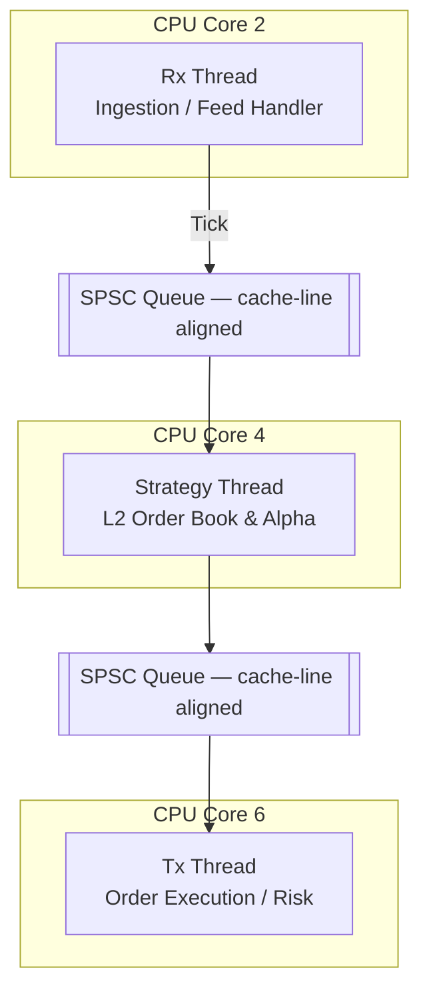

# Hermes ⚡

**Hermes** is an ultra-low-latency, high-frequency trading execution engine written
in C++17. It is designed to probe the physical limits of x86 microarchitecture
through lock-free concurrency primitives, cache-line-aligned data structures, and
hardware-aware thread affinity. The engine is intended as a rigorous systems
engineering reference for sub-100ns tick-to-trade pipeline design.

In cycle-accurate benchmarks, the engine achieves a median (p50) one-way pipeline
latency of **44.22 ns**, with a peak throughput of **32.42M ticks/sec**.

---

## System Architecture

The engine implements a decoupled, three-stage pipeline. Each stage is isolated to a
dedicated physical CPU core to eliminate OS context-switching jitter. Inter-stage
communication is handled exclusively via Single-Producer Single-Consumer (SPSC)
lock-free ring buffers, ensuring the hot path contains no blocking operations.


---

## Performance

HFT systems are characterized not by average latency, but by the **predictability
of the tail**. All latency measurements use the CPU's hardware Time Stamp Counter
(`__rdtsc`) to bypass OS clock syscall overhead and capture true pipeline traversal
cycles.

### One-Way Pipeline Latency — 3.69 GHz reference platform

| Percentile | Cycles | Latency (ns) |
|---|---|---|
| p50 (median) | 163 | 44.22 |
| p99 | 188 | 51.00 |
| p99.9 | 260 | 70.53 |
| Max (OS jitter) | 2,321,408+ | 629,695.86 |

> **Note on Max latency:** The worst-case spike is attributable to non-real-time OS
> interrupts on the Windows development platform. On a production Linux deployment
> with `isolcpus`, `NOHZ_FULL`, and `PREEMPT_RT`, this jitter is suppressed to
> sub-microsecond levels. See [Roadmap](#roadmap).

---

## Concurrency Architecture: Design Decisions & Benchmarks

Selecting the correct synchronization primitive is the single most consequential
architectural decision in an HFT pipeline. The following documents the empirical
investigation conducted to arrive at the final design — each approach was
benchmarked on a 16-core, 3.69 GHz platform under identical conditions.

### Baseline: `std::mutex` Queue

The contention behavior of a mutex-guarded queue establishes the lower bound all
lock-free implementations must beat.

| Threads | Wall Time (ns) | CPU Time (ns) |
|---|---|---|
| 1 | 17.3 | 17.2 |
| 2 | 35.0 | 54.9 |
| 8 | 48.9 | 174.0 |
| 16 | 57.3 | 562.0 |

At 16 threads, CPU time reaches **562 ns** — a **32× overhead** relative to the
uncontended baseline. Each contended lock acquisition forces a kernel context switch,
parking the losing thread and incurring a full OS scheduling round-trip.

---

### Experiment: Lock-Free Stack (CAS Contention)

A natural first candidate for replacing the mutex is a node-based lock-free stack
using `compare_exchange_weak` on a single `head_` pointer.

| Threads | Wall Time (ns) | CPU Time (ns) | Iterations |
|---|---|---|---|
| 1 | 35.1 | 35.6 | 22.4M |
| 2 | 42.6 | 82.0 | 8.9M |
| 8 | 86.8 | 742.0 | 800K |
| 16 | 82.1 | 1,247.0 | 551K |

This approach performs **worse** than the mutex under contention. All threads spin on
a single `head_` pointer — each failed CAS broadcasts a cache-line invalidation to
every competing core, causing catastrophic L1 cache ping-ponging across the MESI
coherence domain. This result demonstrates a critical principle: **lock-free does
not mean wait-free**, and unbounded spinning on a single contention point is strictly
inferior to OS-managed sleeping under high thread counts.

---

### Optimization 1: SPSC Ring Buffer

Replacing the lock with a fixed-capacity ring buffer indexed by `std::atomic<size_t>`
with `acquire`/`release` semantics and `alignas(64)` padding on the indices produced
an immediate and decisive improvement.

| Implementation | Threads | Wall Time (ns) | CPU Time (ns) | Iterations |
|---|---|---|---|---|
| `MutexQueue` | 2 | 33.0 | 47.6 | 12.8M |
| `SPSCQueue` | 2 | 3.61 | 6.98 | 134.2M |

The SPSC queue delivers a **6.8× reduction in CPU time** and **10× throughput
improvement** over the mutex at two threads. Because the design enforces a strict
single-producer / single-consumer contract, no CAS loop is required — the producer
and consumer indices are owned exclusively by their respective threads, eliminating
all contention by construction.

---

### Optimization 2: MPMC Ring Buffer (Distributed Contention)

For completeness, a Vyukov-style array-based MPMC queue — which distributes
contention across per-cell sequence numbers rather than a single head pointer — was
evaluated as an alternative for multi-threaded workloads.

| Threads | Wall Time (ns) | CPU Time (ns) | Iterations |
|---|---|---|---|
| 2 | 4.26 | 8.51 | 112M |
| 8 | 18.6 | 146.0 | 12.5M |
| 16 | 1.82 | 26.4 | 133.8M |

At 16 threads, CPU time reaches **26.4 ns** — **23× faster** than the mutex queue
and **47× faster** than the lock-free stack at equivalent concurrency. The per-cell
sequence number scheme eliminates the single-pointer bottleneck entirely, allowing
contention to scale linearly with available hardware.

Despite this result, the MPMC design was not selected for the Hermes hot path. The
engine's three-stage pipeline has strictly one producer and one consumer per queue by
design, making the additional per-cell atomic overhead of MPMC unnecessary overhead
for this topology.

---

### Optimization 3: Hardware-Optimized SPSC (Final Design)

The production SPSC implementation introduces two further refinements over the
baseline lock-free design.

| Implementation | Threads | Wall Time (ns) | CPU Time (ns) | Iterations |
|---|---|---|---|---|
| Standard SPSC | 2 | 4.15 | 8.29 | 118.7M |
| Optimized SPSC | 2 | **0.936** | **1.84** | 373.3M |

**128-byte struct alignment.** Producer and consumer state are padded to 128 bytes
rather than 64, accounting for hardware prefetcher behavior on some Intel
microarchitectures where adjacent 64-byte lines are speculatively fetched as pairs.
This eliminates residual false sharing that `alignas(64)` alone does not prevent.

**Remote index caching.** Each thread maintains a local cached copy of the
_opposing_ thread's index. A full atomic load is only issued when the cached value
indicates the queue is full or empty — in the common case, the thread operates
entirely on register-resident data with no cross-core coherence traffic.

Together, these optimizations yield a **4.5× reduction in CPU time** over the
baseline SPSC, bringing wall-clock latency to **0.936 ns** per operation. This is
the architecture used on the Rx → Strategy and Strategy → Tx queue segments.

---

## Additional Engineering Implementations

### L2-Resident Limit Order Book

The Limit Order Book (LOB) avoids `std::map` and its associated pointer-chasing
through heap-allocated red-black tree nodes. It is implemented as a **flat
pre-allocated array** indexed by integer price, providing:

- **O(1)** level update and lookup via direct array indexing
- An **~400 KB** total footprint that fits within the CPU's L2 cache
- **Zero heap allocations** on the hot path after initialization

### Integer-Only Hot Path

The Volume-Weighted Imbalance signal avoids all floating-point division. Rather than
computing `bid_vol / ask_vol < 0.33`, the engine uses the equivalent integer
expression `bid_vol * 3 < ask_vol` — a single-cycle multiply versus a 15–40 cycle
`fdiv`.

### Alpha Signal (Pipeline Stress Test)

The Volume-Weighted Order Book Imbalance alpha is acknowledged as foundational and
is not proposed as a production edge. It exists to stress-test the hot path's
integer-math throughput and validate inventory/PnL risk-limit logic under realistic
order flow patterns.

---

## Tech Stack

| Component | Technology |
|---|---|
| Language | C++17 |
| Toolchain | CMake, Ninja, MinGW-w64 |
| Benchmarking | Google Benchmark + custom `__rdtsc` chronometry |
| Hardware Intrinsics | `__rdtsc`, `_mm_pause` |
| Development OS | Windows (affinity via `SetThreadAffinityMask`) |
| Target / Production OS | Linux (affinity via `pthread_setaffinity_np`) |

---

## Roadmap

- **Kernel-Bypass Networking** — Replace BSD socket ingestion with Solarflare
  OpenOnload or DPDK to allow the NIC to write multicast packets directly into the
  SPSC queues without a kernel context switch.
- **Binary ITCH 5.0 Parser** — Replace CSV backtesting ingestion with a zero-copy
  Nasdaq ITCH 5.0 binary protocol decoder, eliminating ASCII parsing overhead on
  the hot path.
- **Latency Regression CI** — Integrate Google Benchmark into the CI/CD pipeline
  with a hard assertion: if p99 regresses by more than 5 ns, the build fails.
- **Linux Production Port** — Finalize migration to `pthread_setaffinity_np`,
  `isolcpus`, `NOHZ_FULL`, and optionally `PREEMPT_RT` for zero-jitter execution
  in a production co-location environment.

---

## Build Instructions
```bash
mkdir build && cd build
cmake .. -G Ninja -DCMAKE_BUILD_TYPE=Release
ninja

./test_queue        # Verify SPSC queue correctness and memory ordering
./latency_rdtsc     # Run cycle-accurate latency benchmark
```