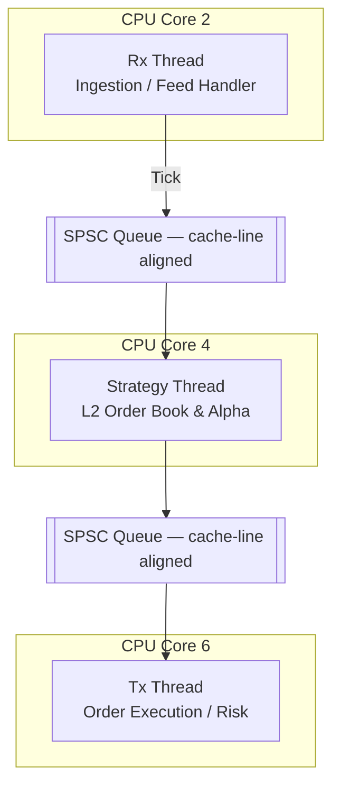

# Hermes ⚡

**Hermes** is an ultra-low-latency, high-frequency trading execution engine written in C++17. It is designed to probe the physical limits of x86 microarchitecture through lock-free concurrency primitives, cache-line-aligned data structures, and hardware-aware thread affinity. The engine is intended as a rigorous systems engineering reference for sub-100ns tick-to-trade pipeline design.

In cycle-accurate benchmarks, the engine achieves a median (p50) one-way pipeline latency of **44.22 ns**, with a peak throughput of **32.42M ticks/sec**.

---

## System Architecture

The engine implements a decoupled, three-stage pipeline. Each stage is isolated to a dedicated physical CPU core to eliminate OS context-switching jitter. Inter-stage communication is handled exclusively via Single-Producer Single-Consumer (SPSC) lock-free ring buffers, ensuring the hot path contains no blocking operations.


---

## Performance

HFT systems are characterized not by average latency, but by the **predictability of the tail**. A p50 of 44 ns is meaningless if the p99.9 reaches milliseconds. All latency measurements use the CPU's hardware Time Stamp Counter (`__rdtsc`) to bypass OS clock syscall overhead and capture true pipeline traversal time.

### One-Way Pipeline Latency — 3.69 GHz reference platform

| Percentile | Cycles | Latency (ns) |
|---|---|---|
| p50 (median) | 163 | 44.22 |
| p99 | 188 | 51.00 |
| p99.9 | 260 | 70.53 |
| Max (OS jitter) | 2,321,408+ | 629,695.86 |

> **Note on Max latency:** The observed worst-case spike is attributable to non-real-time OS interrupts inherent to the Windows development environment. On a production Linux deployment with `isolcpus`, `NOHZ_FULL`, and `PREEMPT_RT`, this jitter is suppressed to sub-microsecond levels. See [Roadmap](#roadmap).

---

## Core Engineering Implementations

### 1. False Sharing Mitigation via Cache-Line Padding

The SPSC queue's `read_idx` and `write_idx` counters are explicitly padded with `alignas(64)` to occupy separate cache lines. Without this, any write to `read_idx` by the consumer core invalidates the cache line holding `write_idx` on the producer core — a phenomenon known as **false sharing** — adding 100–300 ns per operation due to the MESI coherence protocol.

### 2. Lock-Free Concurrency & Memory Ordering

The engine bypasses `std::mutex` entirely. All inter-thread synchronization is implemented with `std::atomic` using the minimum required memory ordering:

| Operation | Ordering | Rationale |
|---|---|---|
| Producer: publish `write_idx` | `memory_order_release` | Ensures all data writes are visible before the index is updated |
| Consumer: read `write_idx` | `memory_order_acquire` | Synchronizes with the producer's release store |
| Data buffer access | `memory_order_relaxed` | Safe once the acquire-release pair is established |

Queue capacity is enforced as a strict power of two (`2ⁿ`), replacing expensive modulo division with a single-cycle bitwise AND (`& mask`) for ring buffer wrapping.

### 3. L2-Resident Limit Order Book

The Limit Order Book (LOB) avoids `std::map` and its associated pointer-chasing through heap-allocated red-black tree nodes. Instead, it is implemented as a **flat pre-allocated array** indexed by integer price. This design provides:

- **O(1)** level update and lookup via direct array indexing
- An **~400 KB** total footprint that physically fits within the CPU's L2 cache
- **Zero heap allocations** on the hot path after initialization

### 4. Alpha Signal (Pipeline Stress Test)

The engine implements a **Volume-Weighted Order Book Imbalance** alpha as a hot-path placeholder. This signal is acknowledged as foundational and is not proposed as a production edge; it exists to stress-test the pipeline's integer-math throughput and validate the inventory/PnL risk-limit logic under realistic order flow patterns.

The signal avoids floating-point division entirely. Rather than computing `bid_vol / ask_vol < 0.33`, it uses the equivalent integer multiply: `bid_vol * 3 < ask_vol` — a single-cycle operation versus a 15–40 cycle `fdiv`.

---

## Tech Stack

| Component | Technology |
|---|---|
| Language | C++17 |
| Toolchain | CMake, Ninja, MinGW-w64 |
| Hardware Intrinsics | `__rdtsc`, `_mm_pause` |
| Development OS | Windows (affinity via `SetThreadAffinityMask`) |
| Target / Production OS | Linux (affinity via `pthread_setaffinity_np`) |

---

## Roadmap

The current repository implements the core logic pipeline. The following infrastructure layers are required for live market deployment:

- **Kernel-Bypass Networking** — Replace BSD socket ingestion with Solarflare OpenOnload or DPDK to allow the NIC to write multicast packets directly into the SPSC queues without a kernel context switch.
- **Binary ITCH 5.0 Parser** — Replace CSV backtesting ingestion with a zero-copy Nasdaq ITCH 5.0 binary protocol decoder, eliminating ASCII parsing overhead on the hot path.
- **Latency Regression CI** — Integrate Google Benchmark into the CI/CD pipeline with a hard assertion: if p99 regresses by more than 5 ns, the build fails.
- **Linux Production Port** — Finalize migration to `pthread_setaffinity_np`, `isolcpus`, `NOHZ_FULL`, and optionally `PREEMPT_RT` for zero-jitter execution in a production co-location environment.

---

## Build Instructions
```bash
mkdir build && cd build
cmake .. -G Ninja -DCMAKE_BUILD_TYPE=Release
ninja

./test_queue        # Verify SPSC queue correctness and memory ordering
./latency_rdtsc     # Run cycle-accurate latency benchmark
```